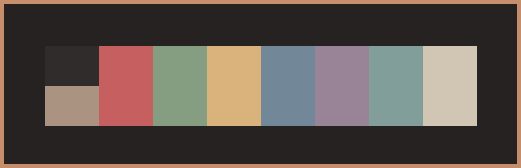
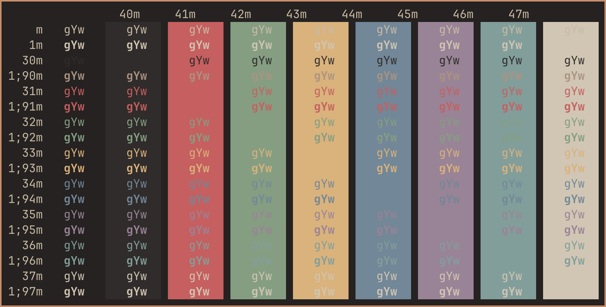

# Chocolate iTerm
The Chocolate color scheme for iTerm2.

 

* [iTerm2 for macOS](https://iterm2.com/)

* [Chocolate color scheme](https://gitlab.com/snakedye/chocolate) 

*Chocolate.itermcolors*

 

